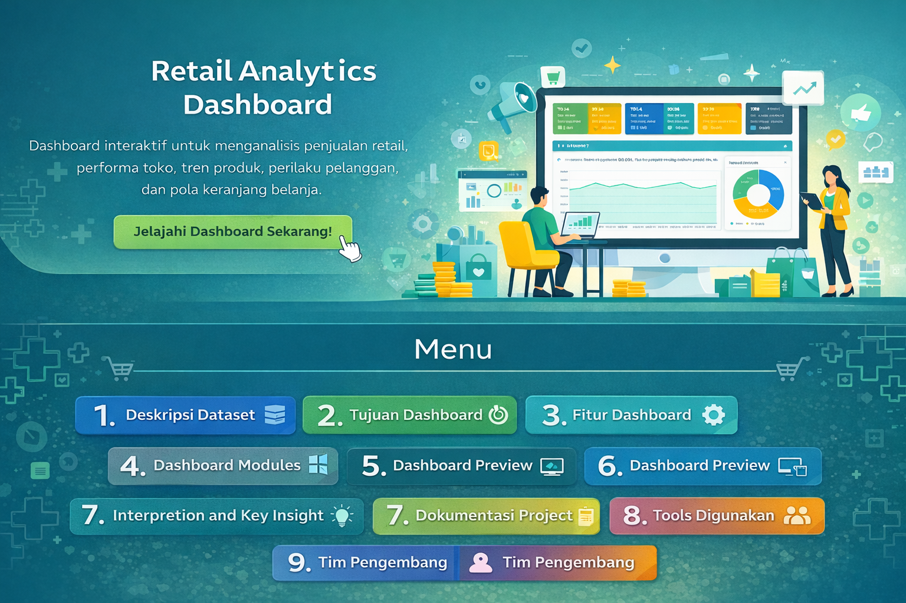
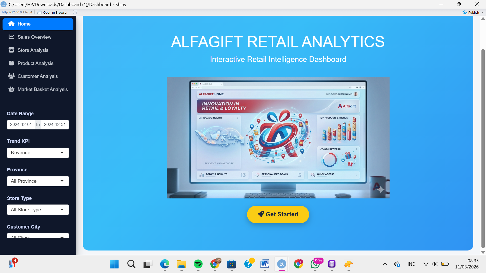
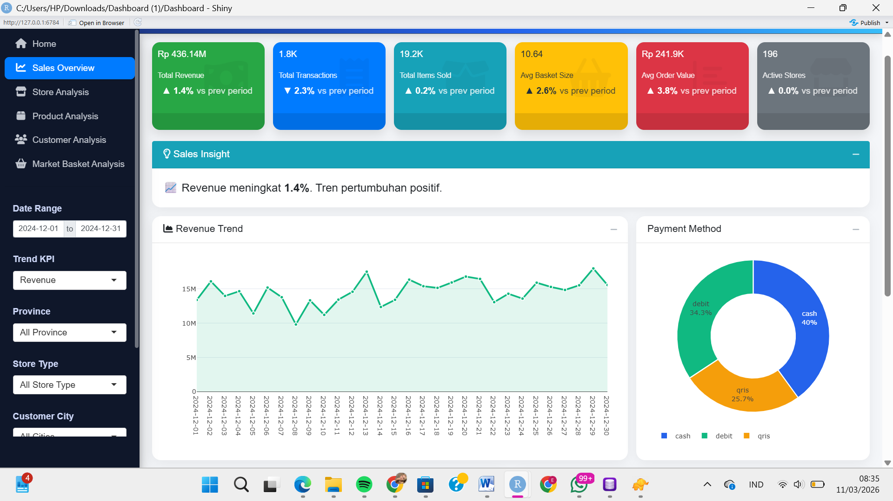
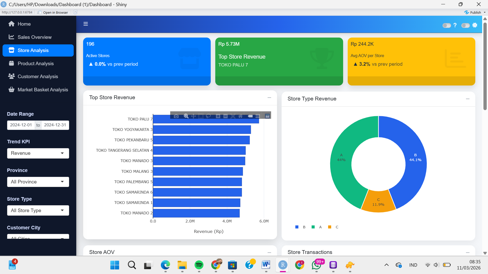
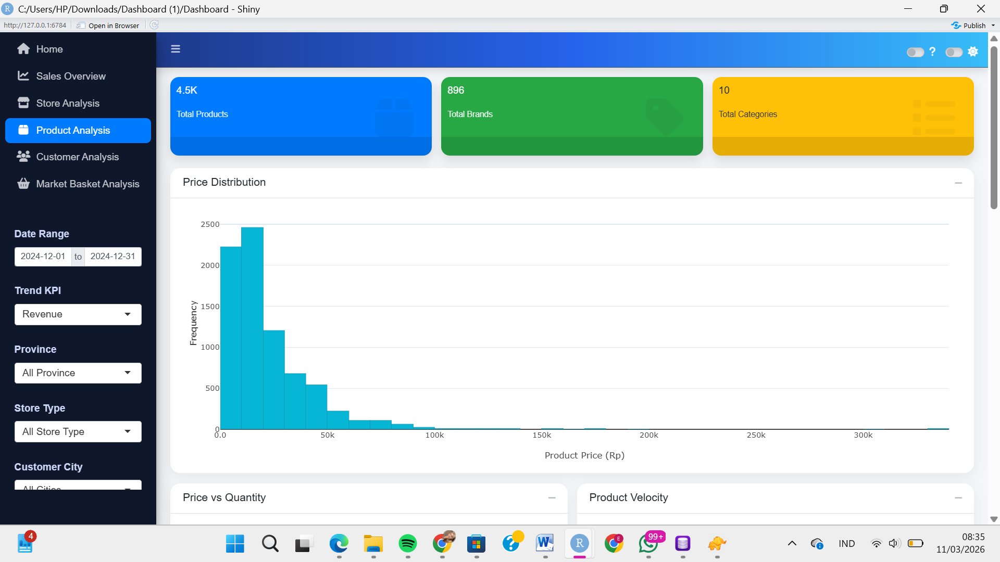
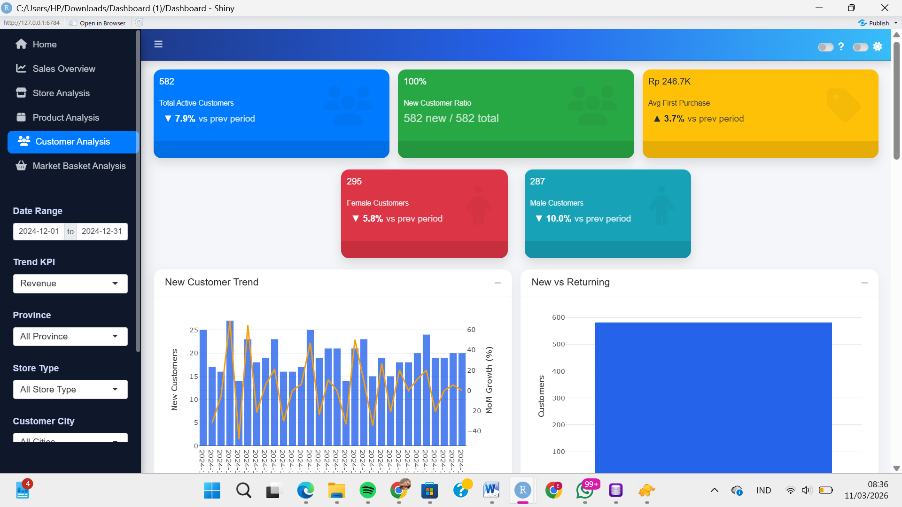
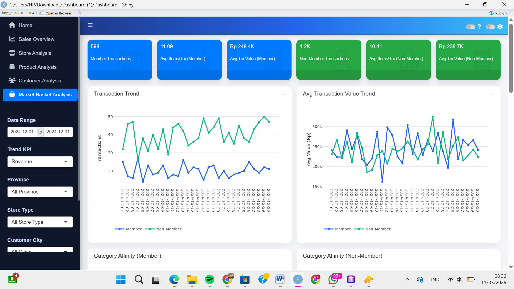

# Retail Analytics Dashboard

Dashboard interaktif untuk menganalisis performa penjualan retail menggunakan data transaksi yang dikumpulkan melalui proses web scraping dan data sintetik.

---

## Deskripsi Dataset

Dataset yang digunakan dalam project ini merupakan **dataset gabungan yang disusun khusus untuk keperluan pembelajaran**. Data diperoleh melalui proses **web scraping dari platform Alfagift**, serta dilengkapi dengan **data bangkitan sintetik** untuk memperkaya struktur data dan meningkatkan kompleksitas kasus analisis.

Seluruh data dalam dataset ini **tidak dimaksudkan untuk merepresentasikan kondisi bisnis aktual secara akurat**, serta **tidak digunakan untuk tujuan komersial**. Data ini juga **tidak mencerminkan data resmi dari pihak terkait**, melainkan hanya digunakan sebagai media pembelajaran dalam analisis data dan pengembangan dashboard analitik.

Dataset yang digunakan merupakan **data transaksi penjualan toko retail** yang terdiri dari **212.170 observasi dan 19 variabel**. Data tersebut mencakup berbagai informasi penting yang berkaitan dengan aktivitas penjualan, antara lain:

- Informasi transaksi penjualan
- Informasi pelanggan (*customer*)
- Informasi toko (*store*)
- Informasi produk (*product*)
- Informasi kategori produk (*category*)

Dataset ini digunakan sebagai dasar dalam melakukan berbagai analisis pada dashboard, seperti analisis performa penjualan, analisis produk, analisis pelanggan, serta analisis pola pembelian produk.

---

## Tujuan Dashboard

Dashboard ini dibuat dengan tujuan untuk membantu memahami performa bisnis retail melalui visualisasi data yang interaktif dan informatif. Melalui dashboard ini, pengguna dapat mengeksplorasi berbagai aspek data transaksi penjualan secara lebih mudah dan intuitif.

Tujuan utama pembuatan dashboard ini antara lain:

- Memantau performa penjualan secara keseluruhan
- Mengidentifikasi toko dengan performa penjualan terbaik
- Menganalisis produk yang memberikan kontribusi penjualan terbesar
- Memahami perilaku dan karakteristik pelanggan
- Mengidentifikasi pola pembelian produk yang sering muncul bersamaan

Dengan adanya dashboard ini, proses eksplorasi dan analisis data dapat dilakukan secara lebih cepat sehingga dapat membantu mendukung pengambilan keputusan berbasis data.

---

## Fitur Dashboard

Dashboard ini dilengkapi dengan berbagai fitur yang memungkinkan pengguna untuk melakukan eksplorasi data secara interaktif.

#### 1. Filtering Data

Dashboard menyediakan beberapa fitur filtering yang memungkinkan pengguna melakukan eksplorasi data secara interaktif berdasarkan berbagai dimensi analisis.

Filter yang tersedia pada dashboard antara lain:

- **Date Range**  
  Digunakan untuk memilih rentang waktu transaksi yang ingin dianalisis.

- **Province**  
  Memungkinkan pengguna memfilter data berdasarkan provinsi tempat toko berada.

- **Store Type**  
  Digunakan untuk melihat performa penjualan berdasarkan tipe toko.

- **Customer City**  
  Digunakan untuk menganalisis distribusi pelanggan berdasarkan kota.

- **Trend KPI**  
  Pengguna dapat memilih indikator utama yang ingin dianalisis dalam grafik tren, seperti revenue atau metrik performa lainnya.

- **Trend Granularity**  
  Mengatur tingkat agregasi data tren menjadi **harian (daily)** atau **bulanan (monthly)**.

- **Customer Trend**  
  Digunakan untuk menampilkan tren pelanggan berdasarkan agregasi waktu **harian** atau **bulanan**.

Fitur filtering ini memungkinkan pengguna melakukan eksplorasi data secara lebih fleksibel untuk memahami berbagai pola dalam data transaksi.

#### 2. Visualisasi Analitik

Dashboard menyajikan berbagai jenis visualisasi data untuk mempermudah analisis, seperti:

- **Line Chart** untuk melihat tren data dari waktu ke waktu
- **Bar Chart** untuk membandingkan performa antar kategori
- **Heatmap** untuk melihat pola aktivitas transaksi
- **Scatter Plot** untuk menganalisis hubungan antar variabel
- **Distribution Plot** untuk memahami distribusi data

Visualisasi ini membantu pengguna memahami pola data secara lebih intuitif dan mendukung proses analisis yang lebih efektif.

### Dashboard Modules

Dashboard ini terdiri dari lima modul utama yang masing-masing dirancang untuk menganalisis aspek berbeda dari aktivitas penjualan retail.

---

### 1. Sales Overview

Modul ini memberikan gambaran umum mengenai performa penjualan secara keseluruhan pada periode yang dipilih. Visualisasi pada bagian ini membantu memonitor tren penjualan, distribusi metode pembayaran, serta aktivitas transaksi.

##### KPI
- Total Revenue
- Total Transactions
- Total Items Sold
- Average Basket Size
- Average Order Value
- Active Stores

##### Visualisasi
- Revenue Trend  
  Menampilkan tren revenue dari waktu ke waktu untuk melihat perkembangan penjualan.

- Payment Method Distribution  
  Menunjukkan distribusi metode pembayaran yang digunakan pelanggan seperti cash, debit, dan QRIS.

- Top 10 Stores by Revenue  
  Menampilkan toko dengan kontribusi revenue tertinggi.

- Transaction Heatmap  
  Menampilkan pola aktivitas transaksi berdasarkan hari dan jam.

---

### 2. Store Analysis

Modul ini digunakan untuk menganalisis performa setiap toko serta kontribusi masing-masing toko terhadap total penjualan.

##### KPI
- Active Stores
- Top Store Revenue
- Average Order Value per Store

##### Visualisasi
- Top Store Revenue  
  Menampilkan toko dengan revenue tertinggi.

- Store Type Revenue  
  Menunjukkan distribusi revenue berdasarkan tipe toko.

- Store AOV  
  Membandingkan rata-rata nilai transaksi antar toko.

- Store Transactions  
  Menampilkan jumlah transaksi yang terjadi pada setiap toko.

---

### 3. Product Analysis

Modul ini digunakan untuk memahami performa produk, termasuk produk dengan penjualan tertinggi, distribusi harga produk, serta kontribusi kategori dan brand terhadap total revenue.

##### KPI
- Total Products
- Total Brands
- Total Categories

##### Visualisasi
- Top Product Revenue  
  Menampilkan produk dengan kontribusi revenue terbesar.

- Top Product Quantity  
  Menampilkan produk dengan jumlah penjualan tertinggi.

- Category Revenue  
  Menunjukkan kontribusi revenue dari masing-masing kategori produk.

- Brand Revenue  
  Menampilkan brand dengan kontribusi penjualan terbesar.

- Product Velocity  
  Mengukur kecepatan penjualan produk (quantity per day).

- Price vs Quantity  
  Menunjukkan hubungan antara harga produk dan jumlah produk terjual.

- Price Distribution  
  Menampilkan distribusi harga produk dalam dataset.

---

### 4. Customer Analysis

Modul ini digunakan untuk memahami karakteristik pelanggan serta perilaku pembelian pelanggan.

##### KPI
- Total Active Customers
- New Customer Ratio
- Average First Purchase Value
- Female Customers
- Male Customers

##### Visualisasi
- New Customer Trend  
  Menampilkan tren pelanggan baru dari waktu ke waktu.

- New vs Returning Customers  
  Membandingkan jumlah pelanggan baru dan pelanggan yang kembali.

- First Purchase Value  
  Menampilkan rata-rata nilai transaksi pada pembelian pertama pelanggan.

- Customer by City  
  Menampilkan distribusi pelanggan berdasarkan kota.

- Gender Revenue  
  Membandingkan kontribusi revenue berdasarkan gender pelanggan.

- Top Cities  
  Menampilkan kota dengan jumlah pelanggan terbanyak.

- Top Customers  
  Menampilkan pelanggan dengan total pembelian tertinggi.

---

### 5. Market Basket Analysis

Modul ini digunakan untuk menganalisis pola pembelian pelanggan serta hubungan antar produk atau kategori yang sering dibeli secara bersamaan dalam satu transaksi.

##### KPI
- Member Transactions
- Average Items per Transaction (Member)
- Average Transaction Value (Member)
- Non-Member Transactions
- Average Items per Transaction (Non-Member)
- Average Transaction Value (Non-Member)

##### Visualisasi
- Transaction Trend  
  Menampilkan tren jumlah transaksi antara member dan non-member.

- Average Transaction Value Trend  
  Menunjukkan perbandingan nilai transaksi rata-rata antara member dan non-member.

- Category Affinity (Member)  
  Menampilkan hubungan antar kategori produk yang sering dibeli bersama oleh member.

- Category Affinity (Non-Member)  
  Menampilkan hubungan antar kategori produk yang sering dibeli bersama oleh non-member.

- Top Subcategory Pairs (Member)  
  Menampilkan pasangan subkategori produk yang paling sering dibeli bersama oleh member.

- Top Subcategory Pairs (Non-Member)  
  Menampilkan pasangan subkategori produk yang paling sering dibeli bersama oleh non-member.

### Dashboard Preview
Berikut merupakan tampilan utama dari dashboard interaktif yang dikembangkan menggunakan Shiny.

## Dashboard Screenshots

### Home

---

### Sales Overview

---

### Store Analysis

---

### Product Analysis

---

### Customer Analysis

---

### Market Basket Analysis

---

## Interpretation & Key Insights

Dataset mencakup periode transaksi dari **5 Januari 2021 hingga 30 Desember 2024**.  
Dashboard menyediakan fitur filtering yang memungkinkan pengguna untuk menganalisis data pada berbagai rentang waktu.

Pada dokumentasi ini, interpretasi hasil difokuskan pada **periode tahun 2024** untuk memberikan gambaran kondisi penjualan terbaru berdasarkan data yang tersedia.

Berdasarkan analisis pada dashboard, beberapa interpretasi hasil dan insight utama yang diperoleh adalah sebagai berikut:

