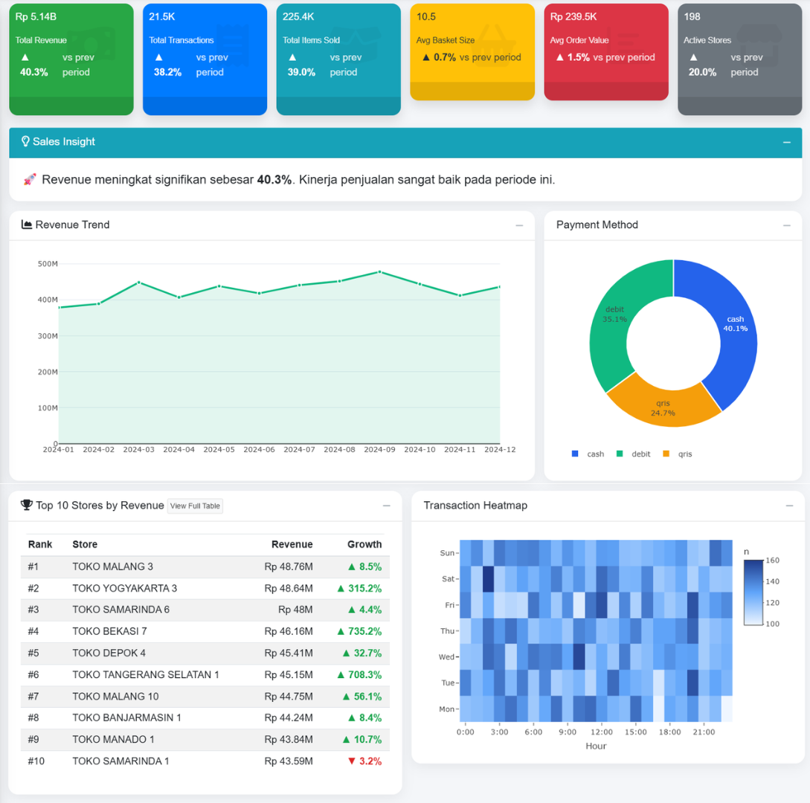
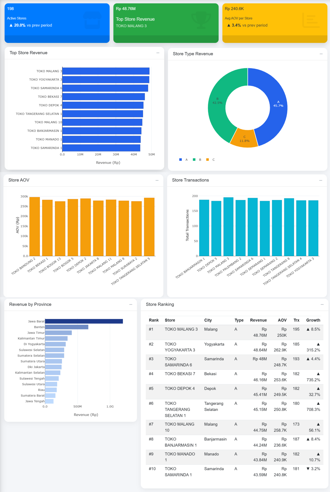
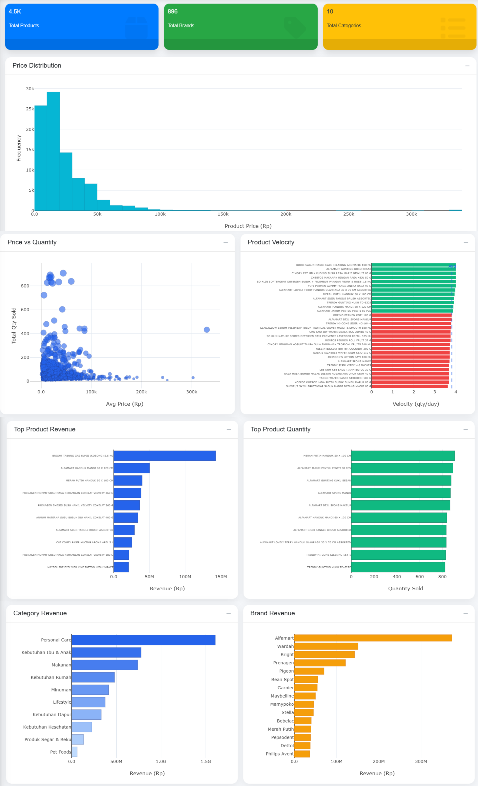
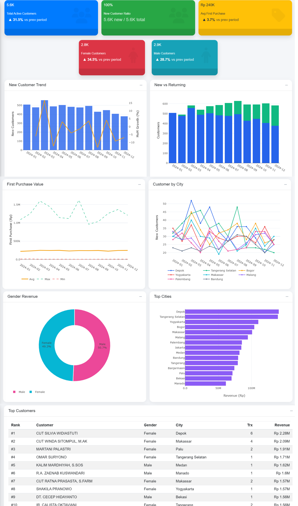
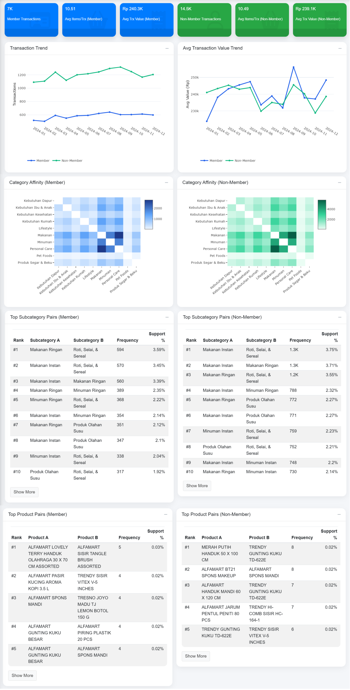
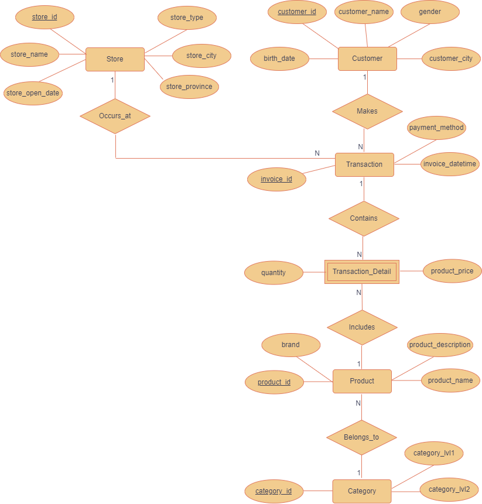
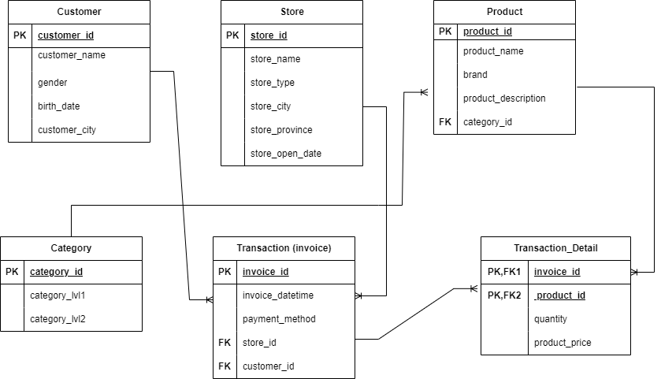

# Retail Analytics Dashboard

Dashboard interaktif untuk menganalisis performa penjualan retail menggunakan data transaksi yang dikumpulkan melalui proses web scraping dan data sintetik.


---

## Deskripsi Dataset

Dataset yang digunakan dalam project ini merupakan **dataset gabungan yang disusun khusus untuk keperluan pembelajaran**. Data diperoleh melalui proses **web scraping dari platform Alfagift**, serta dilengkapi dengan **data bangkitan sintetik** untuk memperkaya struktur data dan meningkatkan kompleksitas kasus analisis.

Seluruh data dalam dataset ini **tidak dimaksudkan untuk merepresentasikan kondisi bisnis aktual secara akurat**, serta **tidak digunakan untuk tujuan komersial**. Data ini juga **tidak mencerminkan data resmi dari pihak terkait**, melainkan hanya digunakan sebagai media pembelajaran dalam analisis data dan pengembangan dashboard analitik.

Dataset yang digunakan merupakan **data transaksi penjualan toko retail** yang terdiri dari **212.170 observasi dan 19 variabel**. Data tersebut mencakup berbagai informasi penting yang berkaitan dengan aktivitas penjualan, antara lain:

- Informasi transaksi penjualan
- Informasi pelanggan (*customer*)
- Informasi toko (*store*)
- Informasi produk (*product*)
- Informasi kategori produk (*category*)

Dataset ini digunakan sebagai dasar dalam melakukan berbagai analisis pada dashboard, seperti analisis performa penjualan, analisis produk, analisis pelanggan, serta analisis pola pembelian produk.

---

## Tujuan Dashboard

Dashboard ini dibuat dengan tujuan untuk membantu memahami performa bisnis retail melalui visualisasi data yang interaktif dan informatif. Melalui dashboard ini, pengguna dapat mengeksplorasi berbagai aspek data transaksi penjualan secara lebih mudah dan intuitif.

Tujuan utama pembuatan dashboard ini antara lain:

- Memantau performa penjualan secara keseluruhan
- Mengidentifikasi toko dengan performa penjualan terbaik
- Menganalisis produk yang memberikan kontribusi penjualan terbesar
- Memahami perilaku dan karakteristik pelanggan
- Mengidentifikasi pola pembelian produk yang sering muncul bersamaan

Dengan adanya dashboard ini, proses eksplorasi dan analisis data dapat dilakukan secara lebih cepat sehingga dapat membantu mendukung pengambilan keputusan berbasis data.

---

## Fitur Dashboard

Dashboard ini dilengkapi dengan berbagai fitur yang memungkinkan pengguna untuk melakukan eksplorasi data secara interaktif.

#### 1. Filtering Data

Dashboard menyediakan beberapa fitur filtering yang memungkinkan pengguna melakukan eksplorasi data secara interaktif berdasarkan berbagai dimensi analisis.

Filter yang tersedia pada dashboard antara lain:

- **Date Range**  
  Digunakan untuk memilih rentang waktu transaksi yang ingin dianalisis.

- **Province**  
  Memungkinkan pengguna memfilter data berdasarkan provinsi tempat toko berada.

- **Store Type**  
  Digunakan untuk melihat performa penjualan berdasarkan tipe toko.

- **Customer City**  
  Digunakan untuk menganalisis distribusi pelanggan berdasarkan kota.

- **Trend KPI**  
  Pengguna dapat memilih indikator utama yang ingin dianalisis dalam grafik tren, seperti revenue atau metrik performa lainnya.

- **Trend Granularity**  
  Mengatur tingkat agregasi data tren menjadi **harian (daily)** atau **bulanan (monthly)**.

- **Customer Trend**  
  Digunakan untuk menampilkan tren pelanggan berdasarkan agregasi waktu **harian** atau **bulanan**.

Fitur filtering ini memungkinkan pengguna melakukan eksplorasi data secara lebih fleksibel untuk memahami berbagai pola dalam data transaksi.

#### 2. Visualisasi Analitik

Dashboard menyajikan berbagai jenis visualisasi data untuk mempermudah analisis, seperti:

- **Line Chart** untuk melihat tren data dari waktu ke waktu
- **Bar Chart** untuk membandingkan performa antar kategori
- **Heatmap** untuk melihat pola aktivitas transaksi
- **Scatter Plot** untuk menganalisis hubungan antar variabel
- **Distribution Plot** untuk memahami distribusi data

Visualisasi ini membantu pengguna memahami pola data secara lebih intuitif dan mendukung proses analisis yang lebih efektif.

### Dashboard Preview
Berikut merupakan tampilan utama dari dashboard interaktif yang dikembangkan menggunakan Shiny.

## Dashboard Screenshots

### Home


---

### Sales Overview



Modul ini memberikan gambaran umum mengenai performa penjualan secara keseluruhan pada periode yang dipilih. Visualisasi pada bagian ini membantu memonitor tren penjualan, distribusi metode pembayaran, serta aktivitas transaksi.

##### KPI
- Total Revenue
- Total Transactions
- Total Items Sold
- Average Basket Size
- Average Order Value
- Active Stores

##### Visualisasi
- Revenue Trend  
  Menampilkan tren revenue dari waktu ke waktu untuk melihat perkembangan penjualan.

- Payment Method Distribution  
  Menunjukkan distribusi metode pembayaran yang digunakan pelanggan seperti cash, debit, dan QRIS.

- Top 10 Stores by Revenue  
  Menampilkan toko dengan kontribusi revenue tertinggi.

- Transaction Heatmap  
  Menampilkan pola aktivitas transaksi berdasarkan hari dan jam.
  
---

### Store Analysis



Modul ini digunakan untuk menganalisis performa setiap toko serta kontribusi masing-masing toko terhadap total penjualan.

##### KPI
- Active Stores
- Top Store Revenue
- Average Order Value per Store

##### Visualisasi

• **Top Store Revenue**  
Menampilkan toko dengan revenue tertinggi untuk mengidentifikasi store dengan performa penjualan terbaik.

• **Store Type Revenue**  
Menunjukkan distribusi revenue berdasarkan tipe toko (A, B, C) untuk memahami kontribusi masing-masing tipe terhadap total penjualan.

• **Store AOV (Average Order Value)**  
Membandingkan rata-rata nilai transaksi antar toko untuk melihat toko dengan nilai pembelian pelanggan yang lebih tinggi.

• **Store Transactions**  
Menampilkan jumlah transaksi yang terjadi pada setiap toko sehingga dapat diketahui toko dengan aktivitas transaksi tertinggi.

• **Revenue by Province**  
Menunjukkan distribusi revenue berdasarkan provinsi sehingga dapat mengidentifikasi wilayah dengan kontribusi penjualan terbesar.

• **Store Ranking**  
Menampilkan peringkat toko berdasarkan performa penjualan yang mencakup informasi revenue, AOV, jumlah transaksi, dan pertumbuhan penjualan.
  
---

### Product Analysis



Modul ini digunakan untuk memahami performa produk, termasuk produk dengan penjualan tertinggi, distribusi harga produk, serta kontribusi kategori dan brand terhadap total revenue.

##### KPI
- Total Products
- Total Brands
- Total Categories

##### Visualisasi
- Top Product Revenue  
  Menampilkan produk dengan kontribusi revenue terbesar.

- Top Product Quantity  
  Menampilkan produk dengan jumlah penjualan tertinggi.

- Category Revenue  
  Menunjukkan kontribusi revenue dari masing-masing kategori produk.

- Brand Revenue  
  Menampilkan brand dengan kontribusi penjualan terbesar.

- Product Velocity  
  Mengukur kecepatan penjualan produk (quantity per day).

- Price vs Quantity  
  Menunjukkan hubungan antara harga produk dan jumlah produk terjual.

- Price Distribution  
  Menampilkan distribusi harga produk dalam dataset.

---

### Customer Analysis



Modul ini digunakan untuk memahami karakteristik pelanggan serta perilaku pembelian pelanggan.

##### KPI
- Total Active Customers
- New Customer Ratio
- Average First Purchase Value
- Female Customers
- Male Customers

##### Visualisasi
- New Customer Trend  
  Menampilkan tren pelanggan baru dari waktu ke waktu.

- New vs Returning Customers  
  Membandingkan jumlah pelanggan baru dan pelanggan yang kembali.

- First Purchase Value  
  Menampilkan rata-rata nilai transaksi pada pembelian pertama pelanggan.

- Customer by City  
  Menampilkan distribusi pelanggan berdasarkan kota.

- Gender Revenue  
  Membandingkan kontribusi revenue berdasarkan gender pelanggan.

- Top Cities  
  Menampilkan kota dengan jumlah pelanggan terbanyak.

- Top Customers  
  Menampilkan pelanggan dengan total pembelian tertinggi.
  
---

### Market Basket Analysis



Modul ini digunakan untuk menganalisis pola pembelian pelanggan serta hubungan antar produk atau kategori yang sering dibeli secara bersamaan dalam satu transaksi.

##### KPI
- Member Transactions
- Average Items per Transaction (Member)
- Average Transaction Value (Member)
- Non-Member Transactions
- Average Items per Transaction (Non-Member)
- Average Transaction Value (Non-Member)

##### Visualisasi
- Transaction Trend  
  Menampilkan tren jumlah transaksi antara member dan non-member.

- Average Transaction Value Trend  
  Menunjukkan perbandingan nilai transaksi rata-rata antara member dan non-member.

- Category Affinity (Member)  
  Menampilkan hubungan antar kategori produk yang sering dibeli bersama oleh member.

- Category Affinity (Non-Member)  
  Menampilkan hubungan antar kategori produk yang sering dibeli bersama oleh non-member.

- Top Subcategory Pairs (Member)  
  Menampilkan pasangan subkategori produk yang paling sering dibeli bersama oleh member.

- Top Subcategory Pairs (Non-Member)  
  Menampilkan pasangan subkategori produk yang paling sering dibeli bersama oleh non-member.
  
---

## ERD

### ERD Konseptual



##### 📊 Overview

ERD Konseptual ini menggambarkan **model data konseptual** untuk sistem data warehouse retail menggunakan **Chen Notation**. Diagram ini menekankan pada pemahaman bisnis dan hubungan antar entitas pada level tinggi, tanpa detail implementasi teknis.

---

##### 🎨 Notasi Chen - Penjelasan Simbol

| Simbol | Bentuk | Keterangan |
|--------|--------|------------|
| **Entity** | Rectangle (Kotak) | Objek bisnis utama yang datanya disimpan |
| **Attribute** | Oval (Lingkaran) | Properti atau karakteristik dari entity |
| **Relationship** | Diamond (Belah Ketupat) | Hubungan antar entity |
| **Primary Key** | Underlined text | Identifier unik untuk entity (ditandai garis bawah) |
| **Cardinality** | 1, N, M | Jumlah instance yang terlibat dalam relationship |

---

#### 🏗️ Struktur Database

##### Entitas Utama (6 Entities)

###### 1. **Customer** (Pelanggan)
Menyimpan informasi pelanggan yang melakukan transaksi.

**Attributes:**
- `customer_id` (PK) - ID unik pelanggan
- `customer_name` - Nama lengkap pelanggan
- `gender` - Jenis kelamin (L/P)
- `birth_date` - Tanggal lahir
- `customer_city` - Kota domisili

**Business Rule:** 
- `customer_id = 0` reserved untuk unknown/guest customers

---

###### 2. **Store** (Toko)
Menyimpan informasi lokasi toko retail.

**Attributes:**
- `store_id` (PK) - ID unik toko
- `store_name` - Nama toko
- `store_type` - Klasifikasi jenis toko (A/B/C)
- `store_city` - Kota lokasi toko
- `store_province` - Provinsi lokasi toko
- `store_open_date` - Tanggal toko mulai beroperasi

---

###### 3. **Transaction** (Transaksi)
Menyimpan header informasi transaksi penjualan.

**Attributes:**
- `invoice_id` (PK) - ID unik transaksi
- `invoice_datetime` - Tanggal dan waktu transaksi
- `payment_method` - Metode pembayaran (cash/debit/credit/e-wallet)

**Business Rule:**
- Satu invoice dapat berisi multiple line items (detail transaksi)

---

###### 4. **Transaction_Detail** (Detail Transaksi)
**⚠️ Weak Entity** - Bergantung pada Transaction

Menyimpan detail produk yang dibeli per transaksi.

**Attributes:**
- `quantity` - Jumlah produk yang dibeli
- `product_price` - Harga satuan produk saat transaksi

**Design Decision:**
- ❌ `line_total` **TIDAK disimpan** (Pure 3NF)
- ✅ Dihitung on-the-fly: `quantity × product_price`

---

###### 5. **Product** (Produk)
Menyimpan informasi produk yang dijual.

**Attributes:**
- `product_id` (PK) - ID unik produk
- `product_name` - Nama produk
- `brand` - Merek produk
- `product_description` - Deskripsi detail produk

**Business Rule:**
- Setiap produk harus belong to satu category

---

###### 6. **Category** (Kategori Produk)
Menyimpan kategori produk dengan hierarki 2 level.

**Attributes:**
- `category_id` (PK) - ID unik kategori
- `category_lvl1` - Kategori utama (main category)
- `category_lvl2` - Sub-kategori (detailed category)

**Business Rule:**
- Natural key: Kombinasi `(category_lvl1, category_lvl2)` harus unique

---

#### 🔗 Relationships

##### 1. **Makes** (Customer → Transaction)
**Cardinality:** `1:N` (One-to-Many)

- **Satu customer** dapat melakukan **banyak transaksi**
- **Satu transaksi** dilakukan oleh **satu customer**

**Business Logic:**
```
Customer (1) ----< Makes >---- (N) Transaction
```

---

##### 2. **Occurs_at** (Store → Transaction)
**Cardinality:** `1:N` (One-to-Many)

- **Satu toko** dapat memiliki **banyak transaksi**
- **Satu transaksi** terjadi di **satu toko**

**Business Logic:**
```
Store (1) ----< Occurs_at >---- (N) Transaction
```
---

##### 3. **Contains** (Transaction → Transaction_Detail)
**Cardinality:** `1:N` (One-to-Many)
**Type:** Identifying Relationship (Transaction_Detail adalah weak entity)

- **Satu transaksi** dapat berisi **banyak line items**
- **Satu line item** belong to **satu transaksi**

**Business Logic:**
```
Transaction (1) ----< Contains >---- (N) Transaction_Detail
```

**Note:** `Transaction_Detail` **tidak bisa exist tanpa Transaction**

---

##### 4. **Includes** (Product → Transaction_Detail)
**Cardinality:** `1:N` (One-to-Many)

- **Satu produk** dapat muncul di **banyak line items** (berbeda transaksi)
- **Satu line item** contain **satu produk**

**Business Logic:**
```
Product (1) ----< Includes >---- (N) Transaction_Detail
```

---

###### 5. **Belongs_to** (Product → Category)
**Cardinality:** `N:1` (Many-to-One)

- **Banyak produk** dapat belong to **satu category**
- **Satu produk** belong to **satu category**

**Business Logic:**
```
Product (N) ----< Belongs_to >---- (1) Category
```

---


### ERD Relational



#### 📊 Overview

ERD Relasional ini menggambarkan **model data fisik** untuk sistem data warehouse retail. Berbeda dari ERD Konseptual yang berfokus pada pemahaman bisnis, ERD Relasional ini menampilkan implementasi teknis lengkap termasuk Primary Key (PK), Foreign Key (FK), dan struktur tabel yang siap diimplementasikan ke dalam database.

---

#### 🎨 Notasi Relasional - Penjelasan Simbol

| Simbol | Keterangan |
|--------|------------|
| **PK** | Primary Key — identifier unik untuk setiap record dalam tabel |
| **FK** | Foreign Key — referensi ke Primary Key tabel lain |
| **PK, FK** | Kolom yang sekaligus berfungsi sebagai Primary Key dan Foreign Key |
| **Garis tunggal** | Sisi "satu" pada relasi One-to-Many |
| **Garis bercabang (crow's foot)** | Sisi "banyak" pada relasi One-to-Many |

---

#### 🏗️ Struktur Tabel

##### 1. **Customer**
Menyimpan informasi pelanggan yang melakukan transaksi.

| Kolom | Tipe | Keterangan |
|-------|------|------------|
| `customer_id` | PK | ID unik pelanggan |
| `customer_name` | | Nama lengkap pelanggan |
| `gender` | | Jenis kelamin (L/P) |
| `birth_date` | | Tanggal lahir |
| `customer_city` | | Kota domisili pelanggan |

> **Business Rule:** `customer_id = 0` reserved untuk unknown/guest customers.

---

##### 2. **Store**
Menyimpan informasi lokasi toko retail.

| Kolom | Tipe | Keterangan |
|-------|------|------------|
| `store_id` | PK | ID unik toko |
| `store_name` | | Nama toko |
| `store_type` | | Klasifikasi jenis toko (A/B/C) |
| `store_city` | | Kota lokasi toko |
| `store_province` | | Provinsi lokasi toko |
| `store_open_date` | | Tanggal toko mulai beroperasi |

> **Business Rule:** `store_id = 0` reserved untuk unknown/online-only stores.

---

##### 3. **Category**
Menyimpan kategori produk dengan hierarki 2 level.

| Kolom | Tipe | Keterangan |
|-------|------|------------|
| `category_id` | PK | ID unik kategori |
| `category_lvl1` | | Kategori utama (main category) |
| `category_lvl2` | | Sub-kategori (detailed category) |

> **Business Rule:** Kombinasi `(category_lvl1, category_lvl2)` harus unik.

---

##### 4. **Product**
Menyimpan informasi produk yang dijual.

| Kolom | Tipe | Keterangan |
|-------|------|------------|
| `product_id` | PK | ID unik produk |
| `product_name` | | Nama produk |
| `brand` | | Merek produk |
| `product_description` | | Deskripsi detail produk |
| `category_id` | FK | Referensi ke tabel Category |

> **Business Rule:** Setiap produk harus belong to satu kategori.

---

##### 5. **Transaction (invoice)**
Menyimpan header informasi transaksi penjualan.

| Kolom | Tipe | Keterangan |
|-------|------|------------|
| `invoice_id` | PK | ID unik transaksi |
| `invoice_datetime` | | Tanggal dan waktu transaksi |
| `payment_method` | | Metode pembayaran (cash/debit/credit/e-wallet) |
| `store_id` | FK | Referensi ke tabel Store |
| `customer_id` | FK | Referensi ke tabel Customer |

> **Business Rule:** Satu invoice dapat berisi multiple line items (detail transaksi).

---

##### 6. **Transaction_Detail**
⚠️ **Weak Entity** — Bergantung pada tabel Transaction dan Product.

Menyimpan detail produk yang dibeli per transaksi.

| Kolom | Tipe | Keterangan |
|-------|------|------------|
| `invoice_id` | PK, FK1 | Referensi ke tabel Transaction |
| `product_id` | PK, FK2 | Referensi ke tabel Product |
| `quantity` | | Jumlah produk yang dibeli |
| `product_price` | | Harga satuan produk saat transaksi |

> **Design Decision:** `line_total` **tidak disimpan** (Pure 3NF). Nilai total dihitung on-the-fly: `quantity × product_price`.

---

#### 🔗 Relasi Antar Tabel

| Relasi | Tabel Asal | Tabel Tujuan | Kardinalitas | Keterangan |
|--------|-----------|--------------|--------------|------------|
| Makes | Customer | Transaction | 1 : N | Satu customer dapat melakukan banyak transaksi |
| Occurs_at | Store | Transaction | 1 : N | Satu toko dapat memiliki banyak transaksi |
| Contains | Transaction | Transaction_Detail | 1 : N | Satu transaksi dapat berisi banyak line items |
| Includes | Product | Transaction_Detail | 1 : N | Satu produk dapat muncul di banyak line items |
| Belongs_to | Product | Category | N : 1 | Banyak produk dapat belong to satu kategori |

---

#### 🔄 Perbedaan ERD Konseptual vs Relasional

| Aspek | ERD Konseptual | ERD Relasional |
|-------|---------------|----------------|
| **Notasi** | Chen Notation (diamond, oval) | Crow's Foot Notation |
| **Level** | Bisnis / konseptual | Teknis / implementasi |
| **FK** | Tidak ditampilkan | Ditampilkan eksplisit |
| **Weak Entity** | Ditandai double rectangle | Ditandai dengan PK,FK |
| **Tujuan** | Pemahaman domain bisnis | Implementasi database |

---

#### 📌 Catatan Desain

- **Normalisasi:** Skema mengikuti **3NF (Third Normal Form)** — tidak ada kolom kalkulasi yang disimpan, semua derived attribute dihitung saat query.
- **Surrogate Key:** Semua tabel menggunakan surrogate key (`_id`) sebagai Primary Key untuk konsistensi dan performa join.
- **Reserved ID = 0:** Digunakan pada Customer dan Store untuk menangani data yang tidak diketahui (unknown/guest) tanpa menggunakan NULL pada FK.


---

#### Tools Digunakan

| Tool | Kategori | Fungsi |
|-----|-----|-----|
| **R Studio** | IDE & Programming Environment | Digunakan sebagai lingkungan utama untuk menulis, menjalankan, dan mengelola skrip R dalam proses pengembangan dashboard analitik. |
| **R Shiny** | Web Framework | Digunakan untuk membangun dashboard interaktif berbasis web yang memungkinkan pengguna melakukan eksplorasi data dan visualisasi secara dinamis. |
| **DBngin** | Database Engine Manager | Digunakan untuk menjalankan dan mengelola instance database secara lokal yang digunakan sebagai penyimpanan data dalam project. |
| **TablePlus** | Database Management Tool | Digunakan untuk mengelola database secara visual, termasuk melihat tabel, melakukan query SQL, dan memvalidasi struktur data. |
| **GitHub** | Version Control & Documentation | Digunakan untuk menyimpan source code project, mengelola versi pengembangan, serta mendokumentasikan hasil project melalui repository. |

----

## Interpretation & Key Insights

Dataset mencakup periode transaksi dari 5 Januari 2021 hingga 30 Desember 2024. Dashboard menyediakan fitur filtering yang memungkinkan pengguna untuk melakukan analisis data pada berbagai rentang waktu sesuai kebutuhan.

Pada dokumentasi ini, interpretasi hasil difokuskan pada periode tahun 2024 dengan tujuan untuk memberikan gambaran kondisi penjualan terbaru berdasarkan data yang tersedia.

Pemilihan periode ini dilakukan untuk memperoleh insight yang lebih relevan terhadap kondisi bisnis terkini, sehingga analisis yang dihasilkan dapat menggambarkan pola transaksi, performa penjualan, serta perilaku pelanggan pada periode terbaru.

Berdasarkan analisis pada dashboard, beberapa interpretasi hasil dan insight utama yang diperoleh adalah sebagai berikut.

---

### Sales Overview

Berdasarkan dashboard **Sales Overview** pada periode tahun **2024**, diperoleh beberapa insight utama terkait performa penjualan sebagai berikut.

#### 1. Kinerja Penjualan
Total revenue yang dihasilkan mencapai **Rp 5.14B** dengan jumlah **21.5K transaksi** dan **225.4K item terjual**. Hal ini menunjukkan bahwa aktivitas penjualan pada periode tersebut cukup tinggi dengan kontribusi dari **198 toko aktif**.

Selain itu, terjadi **peningkatan revenue sebesar 40.3% dibandingkan periode sebelumnya**, yang mengindikasikan pertumbuhan performa penjualan yang signifikan.

#### 2. Perilaku Pembelian Pelanggan
Nilai **Average Basket Size** tercatat sebesar **10.5 item per transaksi**, yang menunjukkan bahwa pelanggan cenderung membeli beberapa produk dalam satu transaksi.

Sementara itu, **Average Order Value (AOV)** berada pada kisaran **Rp 239.5K per transaksi**, yang menggambarkan rata-rata nilai pembelian pelanggan setiap melakukan transaksi.

#### 3. Tren Penjualan
Grafik **Revenue Trend** menunjukkan bahwa performa penjualan relatif stabil sepanjang tahun 2024 dengan fluktuasi pada beberapa bulan tertentu. Peningkatan penjualan terlihat pada pertengahan hingga akhir tahun yang menunjukkan adanya momentum penjualan pada periode tersebut.

#### 4. Metode Pembayaran
Distribusi metode pembayaran menunjukkan bahwa **cash merupakan metode pembayaran yang paling dominan (40.1%)**, diikuti oleh **debit (35.1%)** dan **QRIS (24.7%)**. Hal ini menunjukkan bahwa meskipun pembayaran digital mulai meningkat, transaksi tunai masih menjadi pilihan utama pelanggan.

#### 5. Performa Toko
Berdasarkan tabel **Top 10 Stores by Revenue**, toko dengan performa penjualan tertinggi adalah **TOKO MALANG 3** dengan revenue sebesar **Rp 48.76M**, diikuti oleh **TOKO YOGYAKARTA 3** dan **TOKO SAMARINDA 6**. Hal ini menunjukkan bahwa beberapa toko memiliki kontribusi penjualan yang lebih besar dibandingkan toko lainnya.

#### 6. Pola Waktu Transaksi
Visualisasi **Transaction Heatmap** menunjukkan bahwa aktivitas transaksi terjadi sepanjang hari dengan intensitas yang relatif tinggi pada beberapa jam tertentu. Hal ini menunjukkan adanya pola waktu transaksi yang dapat dimanfaatkan untuk strategi operasional toko.

---

### Store Analysis

Modul **Store Analysis** memberikan gambaran mengenai performa penjualan setiap toko serta distribusi revenue berdasarkan tipe toko dan wilayah.

#### 1. Aktivitas Toko
Pada periode tahun **2024**, terdapat **198 toko aktif** yang berkontribusi terhadap aktivitas penjualan. Jumlah ini menunjukkan adanya peningkatan sebesar **20.0% dibandingkan periode sebelumnya**, yang mengindikasikan ekspansi atau peningkatan aktivitas operasional toko.

#### 2. Toko dengan Performa Penjualan Tertinggi
Berdasarkan indikator **Top Store Revenue**, toko dengan revenue tertinggi adalah **TOKO MALANG 3** dengan nilai penjualan sebesar **Rp 48.76M**. Hal ini menunjukkan bahwa toko tersebut memiliki kontribusi terbesar terhadap total penjualan dibandingkan toko lainnya.

Visualisasi **Top Store Revenue** juga menunjukkan beberapa toko lain yang memiliki performa penjualan tinggi, seperti **TOKO YOGYAKARTA 3** dan **TOKO SAMARINDA 6**.

#### 3. Distribusi Revenue Berdasarkan Tipe Toko
Grafik **Store Type Revenue** menunjukkan bahwa:

- **Tipe A** memberikan kontribusi revenue terbesar yaitu sekitar **45.7%**
- **Tipe B** berkontribusi sekitar **42.5%**
- **Tipe C** memberikan kontribusi lebih kecil yaitu sekitar **11.8%**

Hal ini menunjukkan bahwa toko dengan tipe **A dan B** memiliki peran yang lebih dominan dalam menghasilkan revenue dibandingkan toko tipe C.

#### 4. Rata-rata Nilai Transaksi per Toko
Berdasarkan grafik **Store AOV**, rata-rata nilai transaksi pada setiap toko berada pada kisaran **Rp 250K – Rp 300K** per transaksi. Hal ini menunjukkan bahwa nilai pembelian pelanggan pada setiap toko relatif konsisten.

#### 5. Aktivitas Transaksi Toko
Grafik **Store Transactions** menunjukkan jumlah transaksi yang terjadi pada beberapa toko dengan aktivitas tertinggi. Toko seperti **TOKO MALANG 3**, **TOKO PALEMBANG 2**, dan **TOKO SAMARINDA 6** termasuk dalam kelompok toko dengan jumlah transaksi yang tinggi.

Hal ini menunjukkan bahwa selain memiliki revenue tinggi, toko-toko tersebut juga memiliki tingkat aktivitas transaksi yang tinggi.

#### 6. Distribusi Revenue Berdasarkan Wilayah
Visualisasi **Revenue by Province** menunjukkan bahwa provinsi **Jawa Barat** memberikan kontribusi revenue terbesar dibandingkan provinsi lainnya. Hal ini diikuti oleh provinsi seperti **Banten** dan **Jawa Timur** yang juga memberikan kontribusi penjualan yang signifikan.

Temuan ini menunjukkan bahwa wilayah **Pulau Jawa** masih menjadi pusat utama aktivitas penjualan retail.

#### 7. Peringkat Performa Toko
Tabel **Store Ranking** menampilkan peringkat toko berdasarkan beberapa indikator performa seperti revenue, average order value (AOV), jumlah transaksi, serta pertumbuhan penjualan.

Dari tabel tersebut terlihat bahwa beberapa toko tidak hanya memiliki revenue tinggi tetapi juga menunjukkan **pertumbuhan penjualan yang signifikan**, seperti **TOKO YOGYAKARTA 3** dan **TOKO BEKASI 7**.

---

### Product Analysis

Modul **Product Analysis** memberikan gambaran mengenai karakteristik produk, pola harga, serta kontribusi produk, kategori, dan brand terhadap total penjualan.

#### 1. Struktur Produk
Berdasarkan indikator pada dashboard, terdapat sekitar **4.5K produk**, **896 brand**, dan **10 kategori produk** yang tersedia dalam dataset. Hal ini menunjukkan bahwa variasi produk yang dianalisis cukup besar sehingga memungkinkan analisis yang lebih komprehensif terhadap pola penjualan produk.

#### 2. Distribusi Harga Produk
Grafik **Price Distribution** menunjukkan bahwa sebagian besar produk berada pada rentang harga **di bawah Rp50.000**. Produk dengan harga lebih tinggi relatif lebih sedikit jumlahnya. Hal ini menunjukkan bahwa mayoritas produk yang dijual termasuk dalam kategori **produk dengan harga terjangkau (fast moving consumer goods)**.

#### 3. Hubungan Harga dan Jumlah Penjualan
Visualisasi **Price vs Quantity** menunjukkan bahwa produk dengan harga yang lebih rendah cenderung memiliki jumlah penjualan yang lebih tinggi dibandingkan produk dengan harga tinggi. Hal ini mengindikasikan adanya kecenderungan bahwa produk dengan harga terjangkau lebih sering dibeli oleh pelanggan.

#### 4. Kecepatan Penjualan Produk
Grafik **Product Velocity** menunjukkan tingkat perputaran produk yang diukur dari jumlah unit yang terjual per hari. Beberapa produk memiliki tingkat perputaran yang tinggi sehingga dapat dikategorikan sebagai **fast moving products**, sementara produk lainnya memiliki tingkat perputaran yang lebih rendah.

#### 5. Produk dengan Revenue Tertinggi
Pada grafik **Top Product Revenue**, beberapa produk memberikan kontribusi revenue yang signifikan dibandingkan produk lainnya. Produk seperti **Bright Tabung Gas Elpiji 5.5 Kg** dan beberapa produk rumah tangga lainnya termasuk dalam kelompok produk dengan kontribusi revenue terbesar.

#### 6. Produk dengan Jumlah Penjualan Tertinggi
Grafik **Top Product Quantity** menunjukkan produk yang paling sering dibeli oleh pelanggan. Produk seperti **Merah Putih Handuk 50x100 cm** dan beberapa produk kebutuhan rumah tangga memiliki jumlah penjualan yang tinggi, yang menunjukkan bahwa produk tersebut memiliki permintaan yang tinggi.

#### 7. Kontribusi Revenue Berdasarkan Kategori Produk
Visualisasi **Category Revenue** menunjukkan bahwa kategori **Personal Care** memberikan kontribusi revenue terbesar dibandingkan kategori lainnya. Hal ini diikuti oleh kategori seperti **Kebutuhan Ibu & Anak** serta **Makanan**.

#### 8. Kontribusi Revenue Berdasarkan Brand
Grafik **Brand Revenue** menunjukkan bahwa brand **Alfamart** memberikan kontribusi revenue paling besar dibandingkan brand lainnya. Brand lain seperti **Wardah**, **Bright**, dan **Prenagen** juga memberikan kontribusi yang cukup signifikan terhadap total penjualan.

---

### Customer Analysis

Modul **Customer Analysis** memberikan gambaran mengenai karakteristik pelanggan, pertumbuhan pelanggan baru, distribusi pelanggan berdasarkan gender dan wilayah, serta kontribusi pelanggan terhadap penjualan.

#### 1. Aktivitas Pelanggan
Pada periode tahun **2024**, jumlah **pelanggan aktif mencapai sekitar 5.6K pelanggan**, dengan peningkatan sebesar **31.5% dibandingkan periode sebelumnya**. Hal ini menunjukkan adanya pertumbuhan jumlah pelanggan yang cukup signifikan.

Selain itu, rasio **New Customer Ratio mencapai 100%**, yang menunjukkan bahwa seluruh pelanggan pada periode ini merupakan pelanggan baru dalam sistem.

#### 2. Nilai Pembelian Pertama
Nilai **Average First Purchase** tercatat sekitar **Rp240K**, dengan peningkatan sebesar **3.7% dibandingkan periode sebelumnya**. Hal ini menunjukkan bahwa pelanggan baru memiliki nilai pembelian awal yang cukup baik.

#### 3. Distribusi Pelanggan Berdasarkan Gender
Distribusi pelanggan berdasarkan gender menunjukkan bahwa jumlah pelanggan **laki-laki dan perempuan relatif seimbang**. Pelanggan **laki-laki menyumbang sekitar 50.7% revenue**, sementara pelanggan **perempuan sekitar 49.3%**, yang menunjukkan bahwa kedua segmen memiliki kontribusi yang hampir sama terhadap penjualan.

#### 4. Tren Pelanggan Baru
Grafik **New Customer Trend** menunjukkan jumlah pelanggan baru yang relatif stabil sepanjang tahun 2024 dengan beberapa fluktuasi pada bulan tertentu. Hal ini menunjukkan adanya konsistensi dalam akuisisi pelanggan baru.

#### 5. Perbandingan Pelanggan Baru dan Pelanggan Lama
Visualisasi **New vs Returning Customers** menunjukkan bahwa pelanggan baru memiliki kontribusi yang cukup dominan dalam aktivitas transaksi. Hal ini mengindikasikan adanya pertumbuhan basis pelanggan selama periode analisis.

#### 6. Distribusi Pelanggan Berdasarkan Kota
Grafik **Customer by City** menunjukkan bahwa pelanggan berasal dari berbagai kota besar seperti **Depok, Tangerang Selatan, Yogyakarta, Bogor, Makassar, dan Malang**. Hal ini menunjukkan bahwa jangkauan pelanggan cukup luas di berbagai wilayah.

#### 7. Kota dengan Kontribusi Revenue Tertinggi
Visualisasi **Top Cities** menunjukkan bahwa kota **Depok** memberikan kontribusi revenue terbesar dibandingkan kota lainnya, diikuti oleh **Tangerang Selatan** dan **Yogyakarta**.

#### 8. Pelanggan dengan Kontribusi Penjualan Tertinggi
Tabel **Top Customers** menampilkan pelanggan dengan kontribusi transaksi tertinggi. Beberapa pelanggan seperti **CUT SILVIA WIDIASTUTI** dan **CUT WINDA SITOMPUL** termasuk dalam pelanggan dengan nilai transaksi tertinggi selama periode analisis.

---

### Market Basket Analysis

Modul **Market Basket Analysis** digunakan untuk mengidentifikasi pola pembelian produk yang sering dibeli secara bersamaan dalam satu transaksi. Analisis ini dilakukan dengan membandingkan pola transaksi antara **member** dan **non-member**.

#### 1. Aktivitas Transaksi Member dan Non-Member
Berdasarkan indikator pada dashboard, jumlah transaksi dari **non-member (14.5K transaksi)** lebih tinggi dibandingkan **member (7K transaksi)**. Hal ini menunjukkan bahwa sebagian besar aktivitas pembelian berasal dari pelanggan non-member.

Namun demikian, nilai **Average Transaction Value (ATV)** antara kedua kelompok relatif mirip, yaitu sekitar **Rp 240K per transaksi**, yang menunjukkan bahwa nilai pembelian rata-rata pelanggan tidak jauh berbeda antara member dan non-member.

#### 2. Jumlah Produk dalam Setiap Transaksi
Nilai **Average Items per Transaction** menunjukkan bahwa pelanggan member membeli sekitar **10.51 item per transaksi**, sedangkan pelanggan non-member membeli sekitar **10.49 item per transaksi**. Hal ini menunjukkan bahwa pola pembelian antara kedua kelompok pelanggan relatif serupa dalam hal jumlah produk yang dibeli.

#### 3. Tren Transaksi
Grafik **Transaction Trend** menunjukkan bahwa jumlah transaksi non-member secara konsisten lebih tinggi dibandingkan member sepanjang periode analisis. Hal ini menunjukkan bahwa pelanggan non-member masih mendominasi aktivitas transaksi.

#### 4. Tren Nilai Transaksi
Grafik **Average Transaction Value Trend** menunjukkan bahwa nilai transaksi rata-rata antara member dan non-member relatif stabil sepanjang periode analisis, dengan beberapa fluktuasi pada bulan tertentu.

#### 5. Keterkaitan Antar Kategori Produk
Visualisasi **Category Affinity** menunjukkan adanya hubungan pembelian antar kategori produk. Beberapa kategori seperti **Makanan**, **Minuman**, dan **Personal Care** memiliki tingkat keterkaitan yang cukup tinggi, yang menunjukkan bahwa kategori tersebut sering dibeli secara bersamaan dalam satu transaksi.

#### 6. Pasangan Subkategori Produk
Tabel **Top Subcategory Pairs** menunjukkan kombinasi subkategori produk yang paling sering dibeli bersama. Contohnya, kombinasi seperti **Makanan Ringan dengan Roti, Selai & Sereal** serta **Makanan Instan dengan Makanan Ringan** sering muncul dalam satu transaksi.

Hal ini menunjukkan adanya pola pembelian yang dapat dimanfaatkan untuk strategi **bundling produk** atau **penataan produk pada rak toko**.

#### 7. Pasangan Produk yang Sering Dibeli Bersama
Analisis **Top Product Pairs** menunjukkan beberapa pasangan produk yang sering muncul dalam transaksi yang sama. Pola ini memberikan indikasi bahwa pelanggan cenderung membeli produk tertentu secara bersamaan, yang dapat dimanfaatkan dalam strategi promosi atau rekomendasi produk.

---

### Kesimpulan Market Basket Analysis
Secara umum, hasil Market Basket Analysis menunjukkan bahwa terdapat pola pembelian tertentu antar kategori maupun antar produk. Informasi ini dapat digunakan untuk memahami perilaku pelanggan serta membantu dalam pengambilan keputusan terkait strategi pemasaran, penempatan produk, dan promosi penjualan.

---

## 👨‍💻 Tim Pengembang

### 📊 Data Analyst
**Wilia Sondriva**  
NIM: M0501251019  
Peran: Analisis data, identifikasi KPI, validasi dashboard, serta penyusunan insight utama dari data transaksi.

---

### 🗄️ Database Manager
**Ni Made Ray Diantari**  
NIM: M0501251033  
Peran: Mendesain struktur database, menyusun ERD, serta menyiapkan query SQL untuk kebutuhan dashboard.

---

### 🎨 Frontend Developer
**Rosita Ria Rusesta**  
NIM: M0501251016  
Peran: Mendesain tampilan UI dashboard, mengatur layout visualisasi, serta memastikan interaksi pengguna berjalan dengan baik.

---

### ⚙️ Backend Developer
**Naila Nabiha Qonita**  
NIM: M0501251060  
Peran: Menghubungkan aplikasi R Shiny dengan database, mengelola reaktivitas server, serta memproses data untuk visualisasi.
